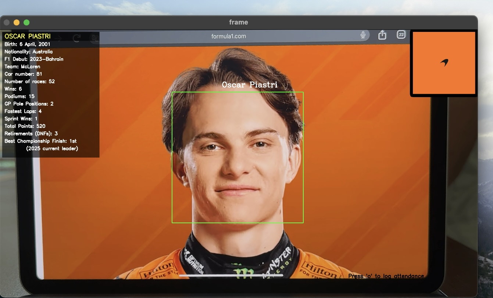

🏁 F1 Real-Time Driver Performance

This project is a computer vision and data visualization system that recognizes Formula 1 drivers via webcam, logs their attendance in real time using an API, and displays driver statistics, rankings, and performance analysis using a dynamic Streamlit dashboard.

🎯 Features

🔍 Face Recognition & Attendance Logging

Recognizes F1 drivers using KNN-based face classification.

Logs timestamped attendance via a Flask API.

Saves data to both .csv and .db files daily.

📈 Streamlit Dashboard

Real-time attendance updates.

Displays:

Driver statistics (wins, podiums, points, DNFs, etc.)

Visual charts:

Wins

Podiums

Fastest laps

Total points

DNFs

Conversion rates (win/podium, win/pole)

Fantasy-style leaderboard with normalized performance scores (0–100).

🧠 Fantasy Scoring Engine

Calculates driver score based on:

Wins, podiums, races

Win/podium conversion

Pole-to-win conversion

Points per race

Fastest lap frequency

DNF rate (penalty)

🎨 Custom Visuals

Overlays driver info, flags, and team logos on recognition screen.

Adds F1 branding (logo) on plots.

🗂️ Folder Structure

f1_driver_recognition/
├── data/
│   ├── logos/               # Team logos (by driver name)
│   ├── flags/               # Flags (by nationality)
│   ├── sample_drivers/      # Portraits were scanned
│   ├── listFaces.pkl        # Serialized face encodings
│   ├── listNames.pkl        # Corresponding labels       
│   └── haarcascade_frontalface_default.xml
│ 
├── dashboard.py             # Main dashboard (Streamlit)
├── recognizeFace.py         # Main recognition and overlay script
├── addFaces.py              # Script to register new faces (Takes 100 shots to learn the object)
├── server.py                # Flask API for attendance
├── driverInfo.py            # Dict with driver stats
├── driverStatisticsChart.py # Creates tables with driver's statistics  
├── driverRatioChart.py      # Creates analyze tables to get the fantasy score 
└── Attendance/              # Daily .csv and .db attendance logs

🚀 How to Run It
1. Create Virtual Environment
    python3 -m venv venv
    source venv/bin/activate
    macOS (optional TTS): pip install -r requirements-macos.txt

2. Add faces 
    python addFaces.py

3. Start the Flask API
    python server.py

4. Launch Streamlit Dashboard
    streamlit run dashboard.py

5. Run Face Recognition
    python recognizeFace.py

🧪 Sample Drivers (included)

Max Verstappen

Lewis Hamilton

Charles Leclerc

Oscar Piastri

Lando Norris

Kimi Antonelli

Fernando Alonso

Carlos Sainz

Alexander Albon 

George Russell

✅ Tech Stack

Python (OpenCV, Streamlit, Flask, SQLite, matplotlib)

Computer Vision: KNN classifier + Haar Cascades

Data Viz: Bar charts, conversion metrics, fantasy scoring

TTS: pyttsx3 voice confirmation

🔌 Real-World Applications

This pipeline architecture — vision capture → embedding-based classification → 
API logging → live dashboard — maps directly to industrial use cases:
- Automated worker identification in restricted-access environments
- Real-time equipment/parts recognition on assembly lines  
- Edge-deployed perception systems requiring low-latency feedback loops

📦 Requirements

opencv-python
streamlit
matplotlib
pandas
flask
requests
pyttsx3
scikit-learn

## 🎥 Live Demo

Real-time recognition pipeline: face detected → driver identified → 
stats retrieved → overlay rendered in < 100ms

🎓 Author

Elias Arellano Campos - Data Scientist & Developer

🏁 Final Notes

This project mimics a real-world analytics pipeline: data capture (vision), storage (API + DB), and analysis (dashboard).

Ideal for portfolios, demo presentations, or expanding into ML-based driver behavior analytics.
